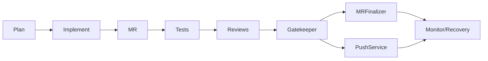

# AgentLab

## Was ist AgentLab?

AgentLab ist ein Python-3.11+-System zur kontrollierten Agent-Orchestrierung fuer GitLab-Repositories. Spezialisierte Agents analysieren Repositories, planen Aufgaben, erzeugen kleine validierte Patches, fuehren Tests und Reviews aus und uebergeben Merge-Entscheidungen an deterministische Gates. LLMs erhalten keine GitLab Tokens und fuehren keine freie Shell aus. Der empfohlene Zielbetrieb ist Kubernetes mit kurzlebigen Jobs. Docker Compose und Local Python nutzen dieselben Kommandos und dieselbe Konfiguration.

## Runtime waehlen

| Runtime | Zweck | Voraussetzungen | Start |
|---|---|---|---|
| Kubernetes | empfohlener Betrieb | kubectl, Image, Cluster | scripts/bootstrap_k8s.py |
| Docker Compose | schneller Container-Test / Single Server | Docker/Compose, Image | scripts/bootstrap_docker.py |
| Local Python | Entwicklung / Debugging / Codex | Python 3.11, Git | pip install -e ".[dev]" |

Alle Runtime-Profile nutzen dieselben Kernkommandos:

```bash
agentlab doctor --config config.yaml
agentlab dry-run --config config.yaml
agentlab index --config config.yaml
agentlab steward --config config.yaml
agentlab plan --config config.yaml
agentlab full-flow --config config.yaml
```

## Quickstart A: Kubernetes Runtime

Kubernetes ist der empfohlene Betrieb. AgentLab laeuft dort als kurzlebige Jobs; GitLab, Ollama und das Zielrepo werden aus dem Cluster heraus erreicht.

1. Bootstrap generieren:

```bash
python scripts/bootstrap_k8s.py \
  --namespace agentlab \
  --image registry.local/agentlab:0.1.0 \
  --gitlab-url https://gitlab.local \
  --target-repo-url https://gitlab.local/group/project.git \
  --ollama-url http://ollama.local:11434 \
  --mode safe-dry-run
```

2. Kubernetes Secret erstellen:

```bash
kubectl -n agentlab create secret generic agentlab-secrets \
  --from-literal=GITLAB_TOKEN="glpat-..." \
  --from-literal=netrc=$'machine gitlab.local\n  login oauth2\n  password glpat-...'
```

Kubernetes Jobs setzen zusaetzlich `GIT_TERMINAL_PROMPT=0` und einen Git `credential.helper`, der das
Passwort erst im Pod aus der Secret-Env `GITLAB_TOKEN` liest. Dadurch funktionieren HTTPS-Clones in
Non-Root-Pods, ohne Token in ConfigMaps oder generierte Job-YAML zu schreiben. Das `.netrc`-Secret bleibt
als Fallback moeglich und wird group-readable fuer `fsGroup: 10001` gemountet.

3. Manifeste anwenden:

```bash
kubectl apply -k deploy/kubernetes/generated
```

4. Doctor Job starten:

```bash
kubectl apply -f deploy/kubernetes/generated/job-doctor.yaml
kubectl -n agentlab logs job/agentlab-doctor -f
```

5. Dry-Run Job starten:

```bash
kubectl apply -f deploy/kubernetes/generated/job-dry-run.yaml
kubectl -n agentlab logs job/agentlab-dry-run -f
```

6. Logs und Artefakte pruefen:

```bash
kubectl -n agentlab logs job/agentlab-dry-run
kubectl -n agentlab get pvc agentlab-runs
```

## Quickstart B: Docker Compose Runtime

Docker Compose ist fuer schnelle lokale Tests oder einen kleinen Single-Server-Betrieb gedacht. Es ist nicht Docker-in-Docker und mountet standardmaessig keinen Docker-Socket.

1. Bootstrap generieren:

```bash
python scripts/bootstrap_docker.py \
  --image registry.local/agentlab:0.1.0 \
  --gitlab-url https://gitlab.local \
  --project group/project \
  --target-repo-url https://gitlab.local/group/project.git \
  --ollama-url http://ollama.local:11434
```

2. `.env.agentlab` erstellen:

```bash
cd deploy/docker/generated
cp .env.agentlab.example .env.agentlab
# GITLAB_TOKEN in .env.agentlab eintragen
```

3. Doctor ausfuehren:

```bash
docker compose run --rm agentlab-doctor
```

4. Dry-Run ausfuehren:

```bash
docker compose run --rm agentlab-dry-run
```

5. Artefakte pruefen:

```bash
ls runs
docker compose run --rm agentlab-index
docker compose run --rm agentlab-steward
```

## Quickstart C: Local Python Runtime

Local Python ist fuer Entwicklung, Debugging, Codex und lokale Tests gedacht. Fuer normalen Betrieb sind Kubernetes oder Docker Compose die bessere Wahl.

1. venv erstellen:

```bash
python -m venv .venv
```

2. installieren:

```bash
source .venv/bin/activate
python -m pip install -e ".[dev]"
```

3. `config.yaml` bereitstellen:

```bash
cp config.example.yaml config.yaml
```

4. Token als Env setzen:

```bash
export GITLAB_TOKEN="glpat-..."
```

5. Doctor ausfuehren:

```bash
agentlab doctor --config config.yaml
```

6. Dry-Run ausfuehren:

```bash
agentlab dry-run --config config.yaml
```

Windows PowerShell nutzt entsprechend `.\.venv\Scripts\Activate.ps1` und `$env:GITLAB_TOKEN = "glpat-..."`.

## Gemeinsame Konfiguration

Alle Runtimes verwenden `config.yaml`. Diese Datei enthaelt keine Secrets.

Minimaler Kern:

```yaml
gitlab_url: "https://gitlab.local"
project_id: "group/project"
default_branch: "main"
gitlab_token_env: "GITLAB_TOKEN"

target_repo_url: "https://gitlab.local/group/project.git"
target_repo_path: "/workspace/repo"
target_repo_ref: "main"
clone_target_repo: true
workspace_root: "/var/lib/agentlab/runs"

ollama:
  base_url: "http://ollama.local:11434"
  models:
    default: "qwen3.6:35b"
    planner: "qwen3.6:35b"
    implementer: "qwen3.6:35b"
    review_quality: "qwen3.6:35b"
    review_security: "qwen3.6:35b"

auto_merge_enabled: false
direct_main_push_enabled: false
push_agent_branches_enabled: false

docker_build_enabled: false
docker_compose_enabled: false
required_test_commands: []
```

`project_id` kann eine numerische GitLab-ID, ein URL-encoded Pfad oder ein normaler Pfad wie `group/project` sein. Wenn `target_repo_url` gesetzt ist und `project_id` fehlt, wird der Projektpfad bestmoeglich aus der Repo-URL abgeleitet.

## GitLab Token Handling

GitLab Tokens werden niemals in `config.yaml`, `compose.yaml`, Kubernetes ConfigMaps, Git oder Prompts geschrieben.

Runtime-spezifisch:

- Kubernetes: Secret `agentlab-secrets`
- Docker Compose: `.env.agentlab`
- Local Python: Environment Variable oder lokale `.env.agentlab`

Empfohlene Scopes:

- Dry Run: `read_api`, `read_repository`
- MR Flow: `api`, `read_repository`, `write_repository`
- Auto-Merge / Direct-Main-Test: `api`, `read_repository`, `write_repository`

`agentlab doctor` erkennt ein fehlendes `GITLAB_TOKEN` und gibt konkrete Fix-Hinweise fuer Local/Docker und Kubernetes aus. Token-Werte werden nicht geloggt.

## Modi

Die Bootstrap-Scripts erzeugen dieselbe Config-Struktur mit unterschiedlichen Sicherheitsflags.

- `safe-dry-run`: `auto_merge_enabled`, `direct_main_push_enabled` und `push_agent_branches_enabled` bleiben `false`.
- `mr-flow`: setzt nur `push_agent_branches_enabled: true`.
- `auto-merge-test`: setzt `push_agent_branches_enabled: true` und `auto_merge_enabled: true`; nur mit `--allow-dangerous-mode`.
- `direct-main-test`: setzt `direct_main_push_enabled: true` und `max_risk_score_for_direct_main_push: 10`; nur mit `--allow-dangerous-mode`.

Die gefaehrlichen Defaults bleiben:

```yaml
auto_merge_enabled: false
direct_main_push_enabled: false
push_agent_branches_enabled: false
```

## Architekturdetails

AgentLab ist kein Rewrite-Tool. Es arbeitet in kleinen, pruefbaren Schritten:

- RepoIndexer erstellt einen deterministischen Whole-Repo-Index.
- BacklogSteward erzeugt priorisierte Wartungsaufgaben.
- Planning Agent plant Aufgaben, ohne Code zu aendern.
- Implementation Agent erzeugt validierte Patches und lokale Commits auf `agent/<task-id>`.
- Functional Test Agent und Build/Security Test Agent fuehren erlaubte Tests und Scanner aus.
- Code Quality Review Agent und Security/Architecture Review Agent pruefen Diffs.
- Gatekeeper nutzt eine deterministische Policy Engine.
- MRFinalizer kommentiert Merge Requests, setzt Labels und darf nur hinter Gates Auto-Merge versuchen.
- PushService ist der einzige Direct-Main-Push-Pfad und nutzt kein LLM.
- Rollback/Recovery Agent erstellt Recovery-Hinweise nach fehlgeschlagenen Pipelines.

Der Integrationsablauf:



Wichtige Run-Artefakte:

- `mr_finalization_result.json`
- `direct_main_push_result.json`
- `post_merge_monitor.json`
- `gate_decision.json`
- `run_provenance.json`
- `supply_chain_report.json`
- `sbom_cyclonedx.json`
- `audit.jsonl`, `events.jsonl`, `status.json`

## Sicherheitsmodell

- LLMs bekommen keine GitLab Tokens.
- LLMs fuehren keine freie Shell aus.
- Shell-Kommandos laufen durch `CommandPolicy`.
- Keine Policy-Aenderung waehrend Agent-Runs.
- Kein Force Push.
- Kein Auto-Merge oder Direct-Main-Push per Default.
- Auto-Merge braucht Gate-Freigabe, MR-Readiness und eine direkt vor Merge erfolgreiche GitLab-Pipeline.
- `merge_mr_guarded` blockiert Draft, Konflikte, geschlossene oder unklare MRs.
- Direct-Main-Push laeuft nur ueber `PushService`.
- Docker Compose wird vor Compose-Operationen lokal auf gefaehrliche Optionen gescannt.
- Kein Docker-Socket-Mount als Standard.
- Keine privileged Kubernetes Pods oder Compose Services.

## Kubernetes Details

`scripts/bootstrap_k8s.py` erzeugt:

```text
deploy/kubernetes/generated/
  namespace.yaml
  serviceaccount.yaml
  pvc.yaml
  configmap.yaml
  secret.example.yaml
  job-doctor.yaml
  job-dry-run.yaml
  job-index.yaml
  job-steward.yaml
  job-plan.yaml
  job-run-task.yaml
  job-full-flow.yaml
  kustomization.yaml
  README.generated.md
```

Die generierten Jobs sind kurzlebig und nutzen:

- `runAsNonRoot: true`
- `runAsUser: 10001`
- `allowPrivilegeEscalation: false`
- `readOnlyRootFilesystem: true`
- Linux Capabilities `drop: ["ALL"]`
- `automountServiceAccountToken: false`
- `emptyDir` fuer `/workspace`, `/tmp` und Home
- PVC fuer `/var/lib/agentlab/runs`
- ConfigMap-Mount fuer `/etc/agentlab/config.yaml`
- Secret-env fuer `GITLAB_TOKEN`
- Git `credential.helper` mit `GITLAB_TOKEN` fuer HTTPS-Clones ohne Prompt
- optionales Secret-Volume fuer `.netrc` mit group-readable Rechten

Die Jobs:

- `job-doctor`: `agentlab doctor --config /etc/agentlab/config.yaml`
- `job-dry-run`: `agentlab dry-run --config /etc/agentlab/config.yaml`
- `job-index`: `agentlab index --config /etc/agentlab/config.yaml`
- `job-steward`: `agentlab steward --config /etc/agentlab/config.yaml`
- `job-plan`: `agentlab plan --config /etc/agentlab/config.yaml`
- `job-run-task`: `agentlab run-task --config /etc/agentlab/config.yaml --task /etc/agentlab/task.json`
- `job-full-flow`: `agentlab full-flow --config /etc/agentlab/config.yaml`

`secret.example.yaml` enthaelt nur Platzhalter. Echte Secrets werden mit `kubectl create secret` erzeugt.

## Docker Details

`scripts/bootstrap_docker.py` erzeugt:

```text
deploy/docker/generated/
  compose.yaml
  config.yaml
  .env.agentlab.example
  README.generated.md
```

Die Compose-Services:

- `agentlab-doctor`
- `agentlab-dry-run`
- `agentlab-index`
- `agentlab-steward`
- `agentlab-plan`
- `agentlab-full-flow`

Gemeinsame Sicherheitsvorgaben:

- `env_file: .env.agentlab`
- `config.yaml` read-only nach `/etc/agentlab/config.yaml`
- Workspace nach `/workspace`
- Runs nach `/var/lib/agentlab/runs`
- `security_opt: no-new-privileges:true`
- `cap_drop: ALL`
- `read_only: true`
- `tmpfs: /tmp`
- kein `privileged: true`
- kein `/var/run/docker.sock` Mount

Docker Build Checks im AgentLab-Container bleiben default `false`. Wenn Build Checks gebraucht werden, nutze GitLab CI, externe Runner, Kaniko oder rootless BuildKit statt Docker-Socket-Mount.

## Komodo optional

Komodo ist optional. AgentLab taeuscht keine harte Komodo-Integration vor.

Optionen:

```bash
python scripts/bootstrap_komodo.py --namespace agentlab
python scripts/bootstrap_k8s.py ... --emit-komodo
```

Erzeugt wird:

```text
deploy/komodo/generated/
  README.md
  job-triggers.md
  agentlab-komodo.example.yaml
```

Die Dateien beschreiben, wie `dry-run`, `plan`, `run-task` und `full-flow` als Kubernetes Jobs getriggert werden koennen. Sie nutzen das bestehende Secret `agentlab-secrets` und enthalten keine Secrets.

## Troubleshooting

`agentlab doctor --config config.yaml --json` liefert maschinenlesbare Checks und Exit Codes:

- `0`: alles okay
- `1`: Warnungen
- `2`: blockierende Fehler

Typische Fixes:

- `FAIL: GITLAB_TOKEN fehlt`: Token als Env, `.env.agentlab` oder Kubernetes Secret bereitstellen.
- `GitLab project was not found`: `project_id` pruefen; `group/project` ist erlaubt.
- `fatal: could not read Username for 'https://gitlab...'`: Kubernetes Jobs muessen `GIT_TERMINAL_PROMPT=0`
  und den generierten Git `credential.helper` enthalten; der Helper liest das Passwort aus `GITLAB_TOKEN`.
  Bei `.netrc`-Fallback muss das Secret fuer den Non-Root-Pod lesbar sein, z. B. group-readable mit
  `fsGroup: 10001`.
- `Ollama API is not reachable`: `ollama.base_url` und Netzwerkpfad pruefen.
- `required_test_commands are not allowed`: Command in `allowed_commands` aufnehmen oder entfernen.
- Docker nicht verfuegbar: Docker-Checks deaktiviert lassen oder externe Build-Gates nutzen.

### Patch apply failed / corrupt patch at line X

Wenn `implementation_report.json` mit `failure_stage: "patch_apply"` und `failure_reason: "corrupt_patch"`
endet, war der Kubernetes-Run selbst gesund; der Implementer hat einen syntaktisch kaputten Unified Diff erzeugt.
Die Runs bleiben dabei fail-safe: ohne gueltigen Patch wird kein Commit erstellt und kein Branch gepusht.

Die Debug-Artefakte liegen im Run-Verzeichnis unter:

```text
<workspace_root>/<run_id>/artifacts/
```

Wichtige Dateien:

- `implementation_report.json`: Status, `failure_stage`, `failure_reason`, `retry_attempted`,
  `no_changes_committed`, `no_branch_pushed` und `patch_artifacts`.
- `implementer_raw_response.json` oder `implementer_raw_response.txt`: rohe Modellantwort, redacted.
- `patch_proposal.json`: geparstes PatchProposal, redacted.
- `raw_patch.diff`: urspruenglicher Unified Diff, redacted.
- `patch_validation_error.json`: strukturierter Fehler aus der Unified-Diff-Validierung vor `git apply`,
  inklusive `line_number`, `offending_line` und `reason`.
- `patch_apply_error.txt` und `patch_apply_stderr.txt`: Fehler aus `git apply` / `git apply --check`.
- `patch_apply_command.json`: ausgefuehrtes Apply-Kommando ohne Patchinhalt.
- `patch_excerpt.txt`: erste 80 Zeilen des Patches.
- Bei Reparaturversuchen: entsprechende `repair_*` Artefakte, z. B. `repair_patch_validation_error.json`.

Zum Gegencheck, dass nichts committed oder gepusht wurde:

```bash
jq '.commit_sha, .pushed, .no_changes_committed, .no_branch_pushed' \
  <workspace_root>/<run_id>/artifacts/implementation_report.json
git -C <target_repo_path> log --oneline --decorate -5
git -C <target_repo_path> status --short
```

AgentLab versucht bei `corrupt patch` genau eine Format-Reparatur des Patches und prueft danach erneut mit
`git apply --check`. Wenn die Reparatur ebenfalls fehlschlaegt, bleibt der Run fehlgeschlagen. Nach Verbesserungen
am Implementer-Patch-Repair kann derselbe Task erneut gestartet werden.

### Docs task fails with corrupt patch

Raw Unified Diffs von LLMs sind fuer Markdown-Aenderungen fragil. Docs- und Markdown-Tasks verwenden deshalb
bevorzugt `implementation_mode: "structured_edit"` statt `PatchProposal`. Der Implementer liefert strukturierte
Operationen wie `insert_before`, `insert_after`, `replace_text`, `append_to_file` oder `replace_file`; AgentLab
schreibt die Datei selbst und prueft danach Diff, Risk, Protected Paths und Secrets. Fuer neue Markdown-Abschnitte
sollten `insert_before` oder `insert_after` mit einem eindeutigen Anchor verwendet werden. `replace_text` ist fuer
kleine, exakt kopierte Textstellen gedacht und bleibt bei grossen Markdown-Bloecken absichtlich streng.

Relevante Artefakte:

- `structured_edit_raw_response.json`: rohe Modellantwort, redacted.
- `structured_edit_proposal.json`: geparstes StructuredEditProposal, redacted.
- `structured_edit_apply_report.json`: angewendete Operationen, geaenderte Dateien und Fallback-Metadaten.
- `structured_edit_error.json`: Fehlergrund, fehlgeschlagener Edit-Index, Pfad, Operation, Hashes, escaped/repr
  Excerpts und bis zu drei `candidate_contexts` aus der Ziel-Datei. Damit werden z. B. Unterschiede zwischen einem
  echten Unicode-Gedankenstrich und literal `\u2014` sichtbar.
- Bei Reparaturversuchen: `structured_edit_repair_raw_response.json`, `structured_edit_repair_proposal.json`,
  `structured_edit_repair_apply_report.json` oder `structured_edit_repair_error.json`.

Bei Fehlern zuerst `implementation_report.json` pruefen, insbesondere `implementation_mode`, `failure_stage`,
`failure_reason`, `retry_attempted`, `retry_succeeded`, `fallback_attempted`, `no_changes_committed` und
`no_branch_pushed`. Bei `old_text_not_found`, `old_text_not_unique`, `anchor_not_found` oder `anchor_not_unique`
versucht AgentLab genau eine sichere Structured-Edit-Reparatur fuer dieselben `affected_files`; Commit und Push
passieren nur, wenn die reparierte Anwendung erfolgreich ist.

Lokale Tests:

```bash
python -m pytest
python -m agentlab.main --help
python -m compileall agentlab
```
