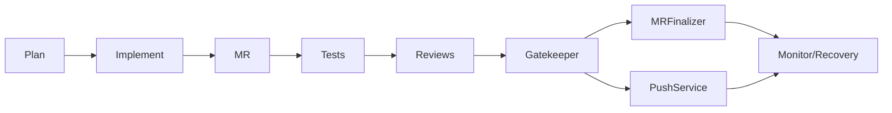

# AgentLab

AgentLab ist ein lokal entwickeltes und spaeter Kubernetes-betriebenes Agent-Orchestrierungssystem fuer GitLab-Repositories. Es ist als produktionsnahes Testsystem gebaut: spezialisierte Agents koennen Aufgaben planen, kleine validierte Patches erzeugen und anwenden, Tests ausfuehren, Security-Pruefungen starten, Diffs reviewen, Merge Requests vorbereiten und alle Merge-Entscheidungen durch deterministische Policy-Gates schicken.

Wichtig: Der Code wird aktuell lokal in einem Git-Workspace entwickelt. Der spaetere Betrieb ist fuer deine Infrastruktur vorgesehen:

- Kubernetes-Cluster aus 3 Debian-13-VMs
- Ollama auf Windows 10 VM mit NVIDIA L40
- GitLab auf Debian 13 VM
- Komodo auf Debian 13 VM

Gefaehrliche Defaults sind ausgeschaltet:

- `auto_merge_enabled: false`
- `direct_main_push_enabled: false`
- `push_agent_branches_enabled: false`
- kein Force Push
- keine GitLab Tokens im LLM-Prompt
- kein Docker-Socket-Mount in den Kubernetes-Beispielen

## Teil 1: Lokale Entwicklung unter Windows/Linux

Dieser Abschnitt beschreibt die Arbeit am AgentLab-Code selbst. Das ist der aktuelle Modus: lokal entwickeln, testen, Docker-/Kubernetes-Artefakte pflegen und spaeter in die Zielumgebung deployen.

### Voraussetzungen

Windows:

- Python 3.11 oder neuer
- Git
- optional Docker Desktop oder eine entfernte Build-Umgebung
- optional `kubectl`, falls du vom Windows-Rechner aus den Cluster steuerst

Linux, zum Beispiel Debian 13:

```bash
sudo apt update
sudo apt install -y python3 python3-venv python3-pip git ca-certificates
```

Optional fuer Image-Builds und Cluster-Steuerung:

```bash
sudo apt install -y docker.io
# kubectl gemaess deiner Cluster-Distribution installieren
```

### Projekt lokal einrichten

Windows PowerShell:

```powershell
cd C:\Users\Fabi\IdeaProjects\agent
python -m venv .venv
.\.venv\Scripts\Activate.ps1
python -m pip install -e ".[dev]"
```

Linux:

```bash
cd /pfad/zu/agent
python3 -m venv .venv
source .venv/bin/activate
python -m pip install -e ".[dev]"
```

### Lokale Konfiguration

Beispielkonfiguration kopieren:

Windows:

```powershell
Copy-Item config.example.yaml config.yaml
```

Linux:

```bash
cp config.example.yaml config.yaml
```

Lokal kann AgentLab auf einen bestehenden Checkout eines Ziel-Repositories zeigen:

```yaml
gitlab_url: "https://gitlab.local"
project_id: 12345
default_branch: "main"

target_repo_path: "../target-repo"
clone_target_repo: false
workspace_root: "./runs"

ollama:
  base_url: "http://ollama.local:11434"

auto_merge_enabled: false
direct_main_push_enabled: false
push_agent_branches_enabled: false
```

GitLab Token nur als Umgebungsvariable setzen. Der Token wird nicht an Ollama uebergeben.

Windows:

```powershell
$env:GITLAB_TOKEN = "glpat-..."
```

Linux:

```bash
export GITLAB_TOKEN="glpat-..."
```

### Lokale Tests

Windows:

```powershell
.\.venv\Scripts\python -m pytest
.\.venv\Scripts\python -m agentlab.main --help
```

Linux:

```bash
.venv/bin/python -m pytest
.venv/bin/python -m agentlab.main --help
```

Aktueller Stand:

```text
76 passed
```

### Lokale CLI-Nutzung

Nach Aktivierung der virtuellen Umgebung:

```bash
agentlab plan --config config.yaml
agentlab index --config config.yaml
agentlab steward --config config.yaml
agentlab supply-chain --config config.yaml
agentlab provenance --config config.yaml
agentlab run-task --config config.yaml --task task.json
agentlab full-flow --config config.yaml
agentlab review-mr --config config.yaml --mr-id 123
agentlab recover --config config.yaml --ref main --commit-sha <sha>
agentlab dry-run --config config.yaml
agentlab preflight --config config.yaml --mode full-flow
agentlab status --config config.yaml
agentlab status --config config.yaml --run-id <run_id> --human
agentlab watch --config config.yaml --run-id <run_id>
```

Fuer `run-task` muss die Task-Datei `"approved": true` enthalten. Das ist Absicht: Implementierung braucht eine explizite Freigabe.

### Whole-Repo-Index und Steward

Damit Agents nicht nur einzelne Dateien sehen, erzeugt AgentLab vor Planning- und Implementierungslaeufen einen deterministischen Repo-Index. Dieser Index ist kein LLM-Output, sondern ein reproduzierbares Artefakt:

```bash
agentlab index --config config.yaml
```

Der Index enthaelt unter anderem:

- Sprachen und Top-Level-Verzeichnisse
- Manifeste wie `pyproject.toml`, `package.json`, `go.mod` oder `Cargo.toml`
- Test-, Dokumentations-, CI-, Docker-, Kubernetes- und Infra-Dateien
- secret-nahe Dateien als eigene Risikokategorie
- Entry-Point-Kandidaten
- TODO/FIXME/HACK-Fundstellen
- Architekturzusammenfassung mit Projektart, Frameworks, Teststrategie, Buildstrategie und Deployment-Signalen

Der Steward baut darauf einen priorisierten Backlog-Report:

```bash
agentlab steward --config config.yaml
```

Dieser Report ist als Grundlage fuer spaetere autonome Wartung gedacht. Er zeigt, welche Aufgaben als naechstes sinnvoll waeren, ohne sofort Code zu aendern.

### Supply Chain und Provenance

AgentLab erzeugt zusaetzlich eine lokale Supply-Chain-Sicht. Sie orientiert sich an CycloneDX fuer maschinenlesbare Software-Inventare und an SLSA/In-Toto fuer Build-/Run-Provenance.

```bash
agentlab supply-chain --config config.yaml
agentlab provenance --config config.yaml
```

`supply-chain` liest bekannte Manifeste wie `pyproject.toml`, `requirements.txt`, `package.json`, `go.mod` und `Cargo.toml`, extrahiert Abhaengigkeiten und schreibt:

- `supply_chain_report.json`
- `sbom_cyclonedx.json`

Dabei werden fehlende Lockfiles als Findings markiert. Standardmaessig blockieren sie nicht. Wenn du spaeter strenger werden willst:

```yaml
require_lockfiles_for_merge: true
```

Dann blockiert der Gatekeeper Merge-Freigaben, wenn Dependency-Manifeste ohne passenden Lockfile erkannt werden.

`provenance` schreibt `run_provenance.json` mit Run-ID, Git-Commit, Dirty-State, redigiertem Config-Hash, Artefakt-Hashes und Policy-Grenzen. Das ist noch keine signierte Attestation, aber ein sinnvoller naechster Schritt Richtung verifizierbarer Runs.

## Post-Gate Integration

Nach Tests, Reviews und Gatekeeper endet `full-flow` nicht mehr bei der Entscheidung. AgentLab erzeugt danach strukturierte Integrationsartefakte:

- `mr_finalization_result.json`
- `direct_main_push_result.json`
- `post_merge_monitor.json`

Der Ablauf:



### MR Finalization and Auto-Merge

`MRFinalizer` schreibt nach dem Gate einen strukturierten Kommentar in den Merge Request. Dieser Kommentar enthaelt Task, Implementierungsstatus, Teststatus, Review-Verdicts, Risk Score, Diff-Statistiken, Blocker, Pipeline-Status, Auto-Merge-Entscheidung, Run-ID und Policy-Checks.

Auto-Merge wird nur versucht, wenn alle Bedingungen gleichzeitig erfuellt sind:

- `auto_merge_enabled: true`
- Gate ist erlaubt
- Gate-Modus ist `merge_request`
- keine Gate-Blocker
- Agent-Branch wurde gepusht
- ein Merge Request existiert
- Merge Request ist nicht draft
- Merge Request hat keine Konflikte
- GitLab meldet einen eindeutig mergebaren Zustand
- die MR-Pipeline ist direkt vor dem Merge `success`

Pipeline-Zustaende wie `pending`, `running`, `created`, `preparing` oder `waiting_for_resource` werden vor dem Merge abgewartet. Zustaende wie `failed`, `canceled`, `skipped`, `manual` oder `missing` blockieren Auto-Merge. Das ist wichtig: Ein Merge basiert nie nur auf lokal bestandenen Tests.

`merge_mr_guarded` merged nur eindeutig mergebare GitLab-Zustaende. Draft-MRs, Konflikte, geschlossene MRs, `not_open`, `checking`, `unchecked` und unbekannte Mergeability werden blockiert. Bei uneindeutigen GitLab-Antworten wird nicht geraten.

Warnung: Der sichere Default bleibt:

```yaml
auto_merge_enabled: false
push_agent_branches_enabled: false
```

Beispiel fuer ein bewusst aktiviertes MR-Setup:

```yaml
push_agent_branches_enabled: true
auto_merge_enabled: true
direct_main_push_enabled: false
```

### Direct Main Push via PushService

Direct-Main-Push laeuft nicht ueber ein LLM und nicht ueber `GitTool.push`. Er ist auf den separaten `PushService` beschraenkt. Dieser Service prueft deterministisch:

- `direct_main_push_enabled: true`
- Gate-Modus `direct_main_push`
- Risk Score unter `max_risk_score_for_direct_main_push`
- keine protected paths
- keine Secrets
- Functional Tests passed
- Build/Security Tests passed
- beide Reviews approved
- Rollback-Plan vorhanden
- kein Dry Run
- sauberer Workspace

Die aktuelle sichere Zwischenstrategie ist: Default Branch aktualisieren, Agent-Commit per Cherry-Pick ohne Commit uebernehmen, finalen Diff erneut pruefen, mit Audit-ID/Task-ID/Risk-Score/Gate-Verdict committen, required test commands erneut ausfuehren und erst danach ohne Force Push pushen.

Wenn nach Cherry-Pick oder lokalem Commit etwas fehlschlaegt, fuehrt AgentLab keinen riskanten automatischen Reset aus. `direct_main_push_result.json` markiert dann, ob ein lokaler Commit existiert, und gibt eine Recovery-Empfehlung wie Inspektion und anschliessendes Zuruecksetzen auf `origin/main` nach menschlicher Pruefung.

Warnung: Direct-Main-Push bleibt fuer produktive Repos hochsensibel und ist default aus:

```yaml
direct_main_push_enabled: false
max_risk_score_for_direct_main_push: 10
```

Bewusst aktiviertes Beispiel nur fuer sehr kleine Low-Risk-Aenderungen:

```yaml
direct_main_push_enabled: true
auto_merge_enabled: false
push_agent_branches_enabled: false
max_risk_score_for_direct_main_push: 10
required_test_commands:
  - "python -m pytest"
```

### Docker/Compose Safety Scanner

Vor Compose-Operationen analysiert AgentLab die Compose-Datei lokal. Der Scanner blockiert Services mit:

- `privileged: true`
- `network_mode: host`
- `pid: host`
- `ipc: host`
- Mounts auf `/`, `/root`, `/home`, `/var/run/docker.sock`, `/etc`, `/var/lib`
- `cap_add`
- `devices`
- `security_opt` mit `apparmor=unconfined` oder `seccomp=unconfined`

Zusaetzlich erzeugt der Scanner nicht-blockierende Findings fuer riskante Signale wie `user: root`, `extra_hosts` mit `host-gateway`, secretartige Environment-Keys und `env_file`-Verweise auf `.env` oder secretartige Dateien.

Findings werden in `BuildSecurityReport` aufgenommen und koennen den Gatekeeper blockieren.

Compose-Dateipfade sind bewusst eingeschraenkt. `DockerTool` akzeptiert nur `docker-compose.yml`, `docker-compose.yaml`, `compose.yml` und `compose.yaml` direkt im Repo-Root. Absolute Pfade, Unterverzeichnisse und `..` werden abgelehnt, bevor ein Docker-Kommando gestartet wird.

### Image lokal bauen

Windows mit Docker Desktop oder Linux mit Docker:

```bash
docker build -t registry.local/agentlab:0.1.0 .
docker push registry.local/agentlab:0.1.0
```

Wenn Docker lokal nicht verfuegbar ist, kann das Image spaeter auf einer Debian-VM, in GitLab CI oder ueber eine dedizierte Build-Umgebung gebaut werden.

## Teil 2: Zielbetrieb auf Debian 13 / Kubernetes

Die spaetere Runtime ist nicht der lokale Entwicklungsworkspace, sondern dein Kubernetes-Cluster aus drei Debian-13-VMs.

Empfohlene Zielarchitektur:

```text
Kubernetes Cluster, 3x Debian 13 VMs
  Namespace: agentlab
    AgentLab Jobs
      - frischer Repo-Checkout pro Run unter /workspace/repo
      - Audit-Logs unter /var/lib/agentlab/runs
      - GitLab Token nur als Kubernetes Secret
      - keine privileged Pods
      - kein Docker Socket

Windows 10 VM mit NVIDIA L40
  Ollama
  http://ollama.local:11434

Debian 13 VM
  GitLab
  https://gitlab.local

Debian 13 VM
  Komodo
  optional fuer Betrieb, Deployments oder spaetere Job-Trigger
```

AgentLab selbst braucht keine GPU. Die Agents rufen Ollama nur ueber die lokale HTTP API auf. Die AgentLab-Runs laufen im Kubernetes-Cluster als kurzlebige Jobs, damit jeder Lauf isoliert, nachvollziehbar und wegwerfbar bleibt.

### Kubernetes-Konfiguration

Im Kubernetes-Cluster wird pro Job frisch in `/workspace/repo` geklont:

```yaml
target_repo_url: "https://gitlab.local/group/project.git"
target_repo_path: "/workspace/repo"
target_repo_ref: "main"
clone_target_repo: true
workspace_root: "/var/lib/agentlab/runs"

ollama:
  base_url: "http://ollama.local:11434"

docker_build_enabled: false
docker_compose_enabled: false
require_repo_policy_for_write: true
```

Wichtig: Keine Zugangsdaten in `target_repo_url` einbauen. Git-Zugriff erfolgt ueber ein Kubernetes Secret, zum Beispiel als gemountete `.netrc`.

### Repo-Policy im Zielrepository

Fuer produktive Repositories sollte im Zielrepo eine `.agentlab.yaml` liegen. AgentLab kann diese Policy pro Run laden und die globale Config damit nur verschaerfen, nie lockern.

Beispiel:

```yaml
version: 1
protected_paths:
  - secrets
  - infra/prod
allowed_task_types:
  - docs
  - tests
  - bugfix
  - refactor
forbidden_task_types:
  - infra
  - database_migration
required_test_commands:
  - python -m pytest
max_changed_files: 10
max_added_lines: 250
max_deleted_lines: 250
max_risk_score_for_merge: 40
block_direct_main_push: true
```

Eine Vorlage liegt unter:

```text
examples/repo-policy.example.yaml
```

Wenn `require_repo_policy_for_write: true` gesetzt ist, blockiert AgentLab Schreib-Modi wie `run-task` und `full-flow`, falls das Zielrepo keine `.agentlab.yaml` enthaelt.

### Kubernetes-Manifeste

Die Manifeste liegen unter:

```text
deploy/kubernetes/
```

Enthalten sind:

- Namespace `agentlab`
- ServiceAccount `agentlab-runner`
- PVC `agentlab-runs`
- ConfigMap `agentlab-config`
- Secret-Beispiel `secret.example.yaml`
- Job-Templates fuer `plan`, `dry-run`, `run-task` und `full-flow`

Vor dem Deployment `deploy/kubernetes/configmap.yaml` anpassen:

- `gitlab_url`
- `project_id`
- `target_repo_url`
- `target_repo_ref`
- `ollama.base_url`
- `protected_paths`
- Risk- und Diff-Limits
- aktivierte Test-/Scanner-Kommandos

Secret mit echten Werten erzeugen:

```bash
kubectl create namespace agentlab
kubectl -n agentlab create secret generic agentlab-secrets \
  --from-literal=GITLAB_TOKEN="glpat-..." \
  --from-literal=netrc=$'machine gitlab.local\n  login oauth2\n  password glpat-...'
```

Basisressourcen anwenden:

```bash
kubectl apply -k deploy/kubernetes
```

Planning Job starten:

```bash
kubectl apply -f deploy/kubernetes/job-plan.yaml
kubectl -n agentlab logs job/agentlab-plan -f
```

Dry Run starten:

```bash
kubectl apply -f deploy/kubernetes/job-dry-run.yaml
kubectl -n agentlab logs job/agentlab-dry-run -f
```

Einen freigegebenen Task ausfuehren:

```bash
kubectl apply -f deploy/kubernetes/task.example.configmap.yaml
kubectl apply -f deploy/kubernetes/job-run-task.yaml
kubectl -n agentlab logs job/agentlab-run-task -f
```

Vor echter Nutzung muss `task.example.configmap.yaml` durch einen freigegebenen Planning-Agent-Task ersetzt werden.

## Komponenten

- Repo Indexer: erstellt eine deterministische, LLM-unabhaengige Sicht auf das gesamte Repository.
- Backlog Steward: bewertet Repo-Gaps und erzeugt priorisierte, policy-kompatible Wartungsaufgaben.
- Planning Agent: analysiert Repository-Struktur, README-Dateien, TODOs, Manifeste und Tests. Aendert keinen Code.
- Implementation Agent: verarbeitet genau einen freigegebenen Task und arbeitet ausschliesslich ueber `PatchProposal`. Er erstellt `agent/<task-id>`, validiert den Patch, wendet ihn ueber `FileTool` an und committet lokal.
- MR Agent: erstellt oder aktualisiert GitLab Merge Requests mit Zusammenfassung, Checkliste, Risiko, Tests und Rollback-Hinweisen.
- Functional Test Agent: erkennt typische Testkommandos wie `python -m pytest`, `npm test`, `pnpm test`, `go test ./...` und `cargo test`.
- Build and Security Test Agent: fuehrt Docker-/Compose-Pruefungen nur aus, wenn sie aktiviert sind. Optionale Scanner wie `trivy`, `gitleaks`, `semgrep`, `bandit` und `npm audit` werden genutzt, wenn sie vorhanden sind.
- Supply Chain Analyzer: erzeugt ein CycloneDX-artiges SBOM, prueft Lockfile-Abdeckung und liefert Findings an den Gatekeeper.
- Provenance Builder: erzeugt eine SLSA/In-Toto-inspirierte Run-Provenance mit Git-, Config- und Artefakt-Hashes.
- MRFinalizer: kommentiert Merge Requests mit strukturierten Reports, setzt Labels und darf bei expliziter Policy Auto-Merge ausloesen.
- PushService: einziger deterministischer Pfad fuer Direct-Main-Push; nutzt keine LLM-Entscheidung und keinen Force Push.
- Docker/Compose Safety Scanner: blockiert riskante Compose-Optionen vor Build-/Security-Gates.
- Code Quality Review Agent: prueft Lesbarkeit, Wartbarkeit, Fehlerbehandlung, Testqualitaet und unnoetige Aenderungen.
- Security and Architecture Review Agent: prueft Secrets, Auth, Injection-Risiken, Dockerfile-Risiken, Dependency-Risiken und Architekturbrueche.
- Gatekeeper: deterministische Policy Engine. Merge- und Direct-Main-Entscheidungen sind keine reine LLM-Entscheidung.
- Rollback/Recovery Agent: prueft fehlgeschlagene Pipelines und erstellt Revert-/Incident-Berichte.

## Transparenz und Live-Status

Jeder Run schreibt drei Dateien unter `workspace_root/<run_id>/`:

```text
audit.jsonl    unveraenderliches Audit-Protokoll
events.jsonl   Live-Event-Stream fuer Tools und spaetere UIs
status.json    aktueller Snapshot des Runs
artifacts/     strukturierte Reports und Entscheidungen
```

`status.json` zeigt:

- globalen Run-Zustand: `pending`, `running`, `passed`, `blocked`, `failed`
- aktuellen Agent
- aktuelle Aktion
- Zustand pro Agent
- letzte Aktion
- Fehler, falls vorhanden
- Pfade zu Audit- und Event-Datei

Beispiele:

```bash
agentlab status --config config.yaml
agentlab status --config config.yaml --run-id <run_id> --human
agentlab watch --config config.yaml --run-id <run_id>
```

Im Kubernetes-Betrieb kannst du weiterhin die Pod-Logs verfolgen:

```bash
kubectl -n agentlab logs job/agentlab-plan -f
```

AgentLab spiegelt jedes Live-Event zusaetzlich als kurze JSON-Zeile auf `stderr`. Dadurch sieht `kubectl logs -f` sofort, welcher Agent welche Aktion startet, abschliesst, blockiert oder mit Fehler beendet. Die finale CLI-Ausgabe bleibt auf `stdout`.

Wenn du diese Live-Events in einer lokalen Shell nicht sehen willst:

Windows:

```powershell
$env:AGENTLAB_LIVE_EVENTS = "0"
```

Linux:

```bash
export AGENTLAB_LIVE_EVENTS=0
```

Fuer maschinenlesbare Transparenz sind `events.jsonl` und `status.json` die dauerhaft wichtigeren Quellen. Ein spaeterer Controller oder ein kleines Dashboard kann direkt darauf aufbauen.

Wichtige Run-Artefakte:

- `preflight_<mode>.json`
- `repo_index.json`
- `architecture_summary.json`
- `steward_report.json`
- `backlog.json`
- `supply_chain_report.json`
- `sbom_cyclonedx.json`
- `run_provenance.json`
- `plan.json`
- `implementation_report.json`
- `functional_test_report.json`
- `build_security_report.json`
- `quality_review.json`
- `security_architecture_review.json`
- `risk_assessment.json`
- `diff_stats.json`
- `gate_decision.json`
- `artifacts/manifest.json`

### Preflight Gates

Vor produktionsnahen Schreiblaeufen sollte immer ein Preflight laufen:

```bash
agentlab preflight --config config.yaml --mode full-flow
```

Der Preflight prueft unter anderem:

- Zielrepo vorhanden oder Clone-Quelle konfiguriert
- keine eingebetteten Git-Credentials in `target_repo_url`
- Git verfuegbar
- Repo-Policy vorhanden, falls fuer Schreibmodi vorgeschrieben
- Target-Checkout sauber, bevor geschrieben wird
- GitLab Token fuer GitLab-Modi vorhanden
- Safety-Switches wie Auto-Merge und Direct-Main-Push
- required test commands sind allowlisted

## Sicherheitsmodell

- LLMs bekommen keine GitLab Tokens.
- LLMs fuehren keine Shell-Kommandos aus.
- Codeaenderungen laufen nur ueber validierte Unified Patches.
- Implementation Agent committet nicht auf den Default Branch.
- Direct-Main-Push ist ausschliesslich ueber `PushService` moeglich und bleibt default deaktiviert.
- MR-Auto-Merge ist ausschliesslich nach Gatekeeper-Freigabe moeglich und bleibt default deaktiviert.
- Shell-Kommandos laufen durch die zentrale CommandPolicy.
- Docker Compose wird vor Compose-Operationen lokal auf gefaehrliche Optionen gescannt.
- Kein Force Push.
- Keine Policy-Aenderung waehrend eines Agent-Runs.
- Kubernetes-Pods laufen als UID `10001`.
- `automountServiceAccountToken: false`
- `readOnlyRootFilesystem: true`
- Linux Capabilities werden gedroppt.
- Kein privileged Pod.
- Kein Docker-Socket-Mount.
- Audit-Logs landen unter `workspace_root/<run_id>/audit.jsonl`.
- Live-Status landet unter `workspace_root/<run_id>/status.json`.
- Live-Events landen unter `workspace_root/<run_id>/events.jsonl`.
- Persistente Reports landen unter `workspace_root/<run_id>/artifacts/`.
- SBOM- und Provenance-Artefakte werden pro Run erzeugt, wenn `supply_chain_enabled` und `provenance_enabled` aktiv sind.

## Docker Builds im Cluster

Die Kubernetes-Beispiele deaktivieren Docker Builds bewusst:

```yaml
docker_build_enabled: false
docker_compose_enabled: false
```

Der Grund: Ein Mount von `/var/run/docker.sock` waere praktisch, aber sicherheitstechnisch fast Root-Zugriff auf den Host. Fuer produktionsnahere Builds sollte spaeter einer dieser Wege ergaenzt werden:

- Kaniko
- rootless BuildKit
- dedizierter externer Build Runner
- GitLab CI Pipeline als Build-Gate

## Recherchebasis fuer diese Sicherheitsrichtung

Die aktuelle Richtung orientiert sich an folgenden Primaerquellen:

- GitLab Merge Request Approvals und Approval API fuer nachvollziehbare Review-Gates.
- GitLab Pipeline API fuer spaetere Pipeline-/Recovery-Gates.
- Kubernetes Pod Security Standards, insbesondere das `Restricted`-Profil.
- Kubernetes Seccomp-Dokumentation mit `RuntimeDefault`.
- SLSA Specification v1.2 fuer Provenance- und Supply-Chain-Evidence.
- OWASP CycloneDX SBOM-Spezifikation fuer maschinenlesbare Software-Inventare.

## Naechste Ausbaustufen

- AgentLab Image in deine interne Registry pushen.
- `configmap.yaml` auf deine lokalen Domaenen/IPs anpassen.
- Netzwerkpfade vom Kubernetes-Cluster zu GitLab und Ollama pruefen.
- Erst `job-plan.yaml`, dann `job-dry-run.yaml` ausfuehren.
- Whole-Repo-Index regelmaessig erzeugen und Steward-Backlog als Governance-Basis verwenden.
- SBOM und Provenance in MR-Kommentare oder externe Evidence Stores uebertragen.
- Danach einen echten Low-Risk Task als ConfigMap mounten und `job-run-task.yaml` testen.
- Spaeter: Controller bauen, der Jobs dynamisch erzeugt und Artefakte/MR-Kommentare zentral verwaltet.
